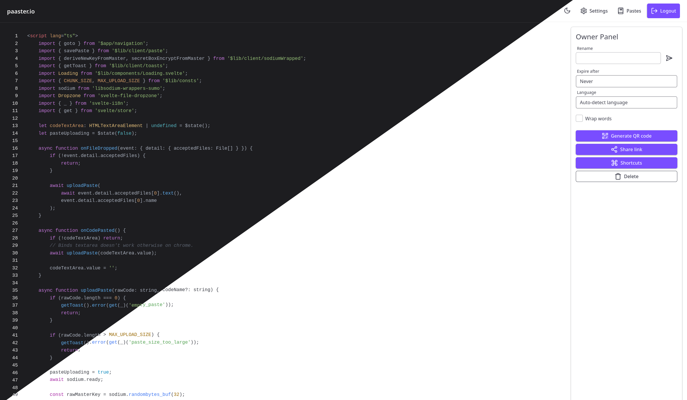

&nbsp;

<div align="center">
  
  <h1>Paaster.io</h1>
  <quote>
    Paaster is a secure and user-friendly pastebin application that prioritizes privacy and simplicity. With end-to-end encryption and paste history, Paaster ensures that your pasted code remains confidential and accessible.
  </quote>

<a href="https://paaster.io/terms-of-service">Terms of service |</a>
<a href="https://paaster.io/privacy-policy"> Privacy policy</a>

</div>

&nbsp;

[Help translate paaster!](https://fink.inlang.com/github.com/WardPearce/paaster)

# Preview



# Features
- [End-to-end encryption](#what-is-e2ee).
- Memory efficient.
- File drag & drop.
- Shortcuts.
- Paste history.
- Delete after view or X amount of time.
- Share via QR code.
- i18n support ([Contribute](https://fink.inlang.com/github.com/WardPearce/paaster)).
- Automatic or manual language detection.
- No dynamically loaded 3rd party dependencies, meaning malicious code must be present at build time.
- Use of `package-lock.json`, `poetry.lock` & [Socket.dev](https://socket.dev/) to fight against supply chain attacks & vulnerabilities.

# Deployment
Paaster requires s3 for deployment, you can use a hosted solution or self-host using [MinIO](https://github.com/minio/minio).

```yaml
services:
  paaster:
    container_name: paaster
    image: wardpearce/paaster:latest
    restart: unless-stopped
    ports:
      - 3015:3000
    environment:
      COOKIE_SECRET: "" # A secure random value

      S3_ENDPOINT: ""
      S3_REGION: ""
      S3_ACCESS_KEY_ID: ""
      S3_SECRET_ACCESS_KEY: ""
      S3_BUCKET: ""
      s3_FORCE_PATH_STYLE: true # Required for minio

      MONGO_DB: "paasterv3"
      MONGO_URL: "mongodb://paaster_mongodb:27017"

  paaster_mongodb:
    image: mongo
    container_name: paaster_mongodb
    restart: unless-stopped
    environment:
      MONGODB_DATA_DIR: /data/db
      MONDODB_LOG_DIR: /dev/null

  # Not required if using a host s3 solution
  # Must be reverse proxied so clients can access it
  paaster_minio:
    container_name: paaster_minio
    image: quay.io/minio/minio
    ports:
      - "9000:9000"
      - "9001:9001"
    environment:
      MINIO_ROOT_USER: ""
      MINIO_ROOT_PASSWORD: "" # A secure random value
    volumes:
      - ~/minio/data:/data
    command: server /data --console-address ":9001"
```

### Object storage providers
- [iDrive e2](https://www.idrive.com/e2/) (no free tier anymore)
- [Backblaze b2](https://www.backblaze.com/b2/cloud-storage.html) (10 GB free)
- [Wasabi Hot Cloud Storage](https://wasabi.com/hot-cloud-storage/)
- [Storj](https://www.storj.io/) (25GB free tier)
- [Contabo object storage](https://contabo.com/en/object-storage/)
- [Cloudflare R2](https://www.cloudflare.com/products/r2/)
- [Amazon S3](https://aws.amazon.com/s3/)
- [Google Cloud Storage](https://cloud.google.com/storage)


# Security

## What is E2EE?

End-to-end encryption (E2EE) is a zero-trust encryption methodology. When you paste code into Paaster, it is encrypted locally in your browser using a secret that is never shared with the server. Only people you share the link with can view the paste.

## Can I trust a instance of paaster not hosted by me?

No. Anyone could modify the functionality of Paaster to expose your secret key to the server. We recommend using a instance you host or trust.

## How are client secrets stored?

Client secrets are stored with IndexedDB when the paste is created, allowing for paste history. This method of storage makes Paaster vulnerable to malicious JavaScript, but it would require malicious code to be present when the Svelte application is built.

## How are client secrets transported?

Paaster uses URI fragments to transport secrets, according to the [Mozilla foundation](https://developer.mozilla.org/en-US/docs/Learn/Common_questions/Web_mechanics/What_is_a_URL#anchor) URI fragments aren't meant to be sent to the server. Bitwarden also has a article covering this usage [here](https://bitwarden.com/blog/bitwarden-send-how-it-works/).

## How are server secrets stored?

Server secrets are stored with IndexedDB when the paste is created, allowing for modification or deletion of pastes later on. The server-sided secrets are generated using the Python secrets module and stored in the database using bcrypt hashing.

## Cipher

Paaster uses the following libsodium functions crypto_secretstream_xchacha20poly1305_*, crypto_pwhash & crypto_secretbox_easy, which is implemented using the [libsodium-wrappers-sumo](https://www.npmjs.com/package/libsodium-wrappers-sumo) library.

# Requesting features

- Open a [new issue](https://github.com/WardPearce/paaster/issues/new) to request a feature (one issue per feature.)

## What we won't add

- Paste editing.
  - Paaster isn't a text editor, it's a pastebin.
- Paste button.
  - Paaster isn't a text editor, when code is inputted it will always be automatically uploaded.
- Optional encryption.
  - Paaster will never have opt-in / opt-out encryption, encryption will always be present.

# Have any questions?
[Join our Matrix space](https://matrix.to/#/#ward:matrix.org)
