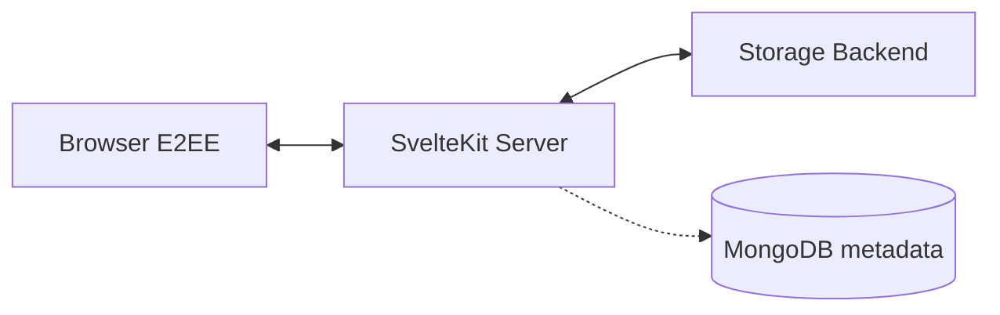

# Architecture

## Overview

Paaster separates concerns into three layers:



### Metadata storage (MongoDB)

All paste metadata lives in MongoDB, regardless of the content storage backend:

| Collection | Purpose |
|---|---|
| `pastes` | Paste metadata (header, salts, encrypted names, expiry, access key hash) |
| `pasteChunks` | Chunk storage when using the MongoDB backend |
| `users` | User accounts (password hashes, encryption keys, 2FA) |
| `sessions` | Authentication sessions |
| `userPastes` | User-to-paste bookmarks |
| `captcha` | Used CAPTCHA challenge signatures |

### Content storage (pluggable)

Paste content (the encrypted binary blob) can be stored in one of three backends:

- **S3-compatible object storage** — Garage, AWS S3, Cloudflare R2, Wasabi, etc.
- **MongoDB** — chunks stored in the `pasteChunks` collection
- **Filesystem** — chunks stored as individual files

The storage backend is selected via the `STORAGE_BACKEND` environment variable.

### Chunked storage

Each encrypted 1 MB chunk is stored as an individual object/file/document, keyed by `{pasteId}/chunks/{chunkIndex}`. This allows:

- Individual chunk retrieval
- Efficient streaming for large pastes
- Simple integrity checking per chunk

## Request flow

### Creating a paste

```
1. Browser encrypts text in 1 MB chunks
2. POST /api/paste       → creates metadata, returns pasteId
3. POST /api/paste/{id}/chunks  → uploads each chunk
4. Browser stores master key (URL fragment) + access key (IndexedDB)
```

### Viewing a paste

```
1. Browser requests /{pasteId}
2. Server returns metadata + totalChunks
3. Browser fetches each chunk from GET /api/paste/{id}/chunks/{n}
4. Browser decrypts chunks sequentially using the master key from the URL fragment
```

### Deleting a paste

```
1. DELETE /api/paste/{id}  → server deletes metadata + all chunks
```
