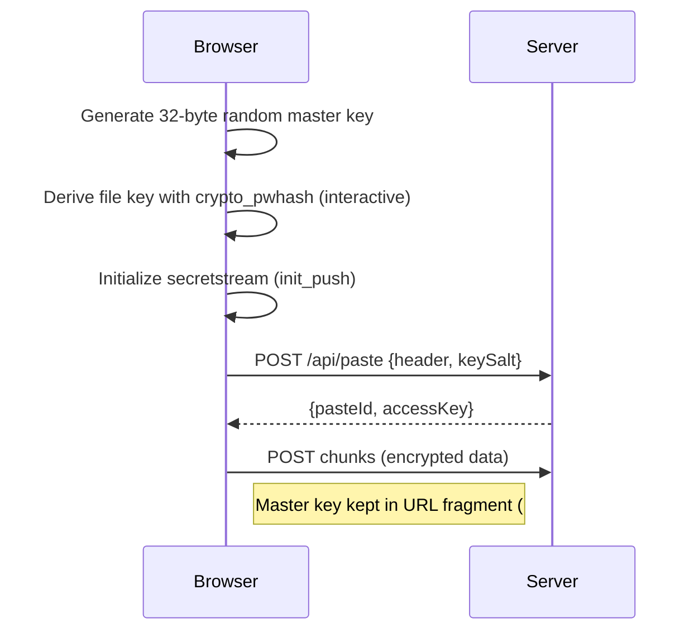

# Client-side Encryption

Paaster uses **libsodium-wrappers-sumo** for all cryptographic operations. All encryption happens in the browser; the server never has access to unencrypted content.

## Key derivation



1. A 32-byte random **master key** is generated
2. A **file encryption key** is derived from the master key using `crypto_pwhash` (interactive ops limits, 2 second target)
3. `crypto_secretstream_xchacha20poly1305_init_push` creates the **stream state** and **header**
4. The **header** and **key salt** are sent to the server as metadata

## Encryption

Each 1 MB plaintext chunk is encrypted with:

```
crypto_secretstream_xchacha20poly1305_push(state, chunk, null, tag)
```

- `TAG_MESSAGE` for all chunks except the last
- `TAG_FINAL` for the final chunk

Encrypted chunks are uploaded directly as-is — no length prefix or framing is added since each chunk is stored individually.

## Decryption

1. Fetch metadata (header, keySalt) from the page load
2. Re-derive the file key from the master key (URL fragment) and stored salt
3. Initialize pull state: `crypto_secretstream_xchacha20poly1305_init_pull(header, fileKey)`
4. Fetch each chunk and decrypt: `crypto_secretstream_xchacha20poly1305_pull(state, chunk, null)`

## Optional encryption metadata

Paste names and language tags are also encrypted using `crypto_secretbox_easy` with a separate derived key from the same master key. The salts and nonces are stored alongside the paste metadata.
