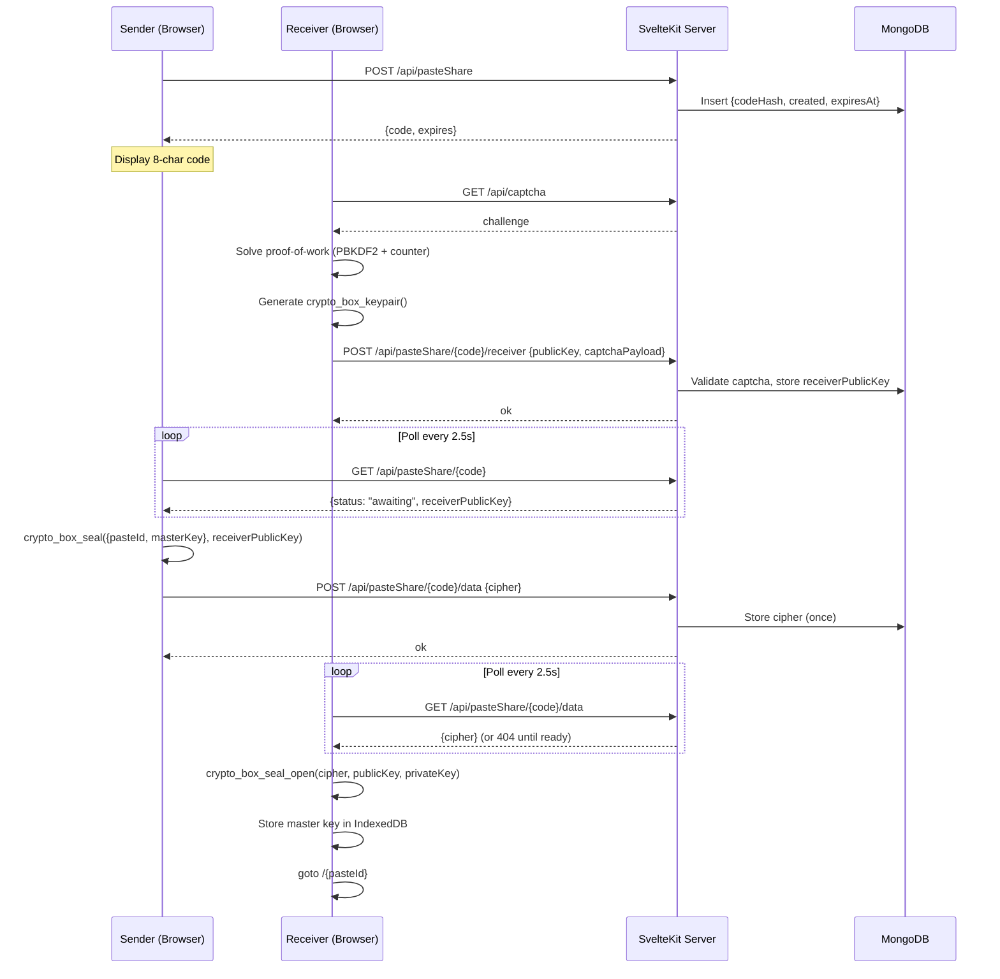

# Quick Connect

Quick Connect securely transfers the paste you're viewing to another of your devices — for example, from your phone to your desktop — without manually copying the link. It's the mechanism behind the **Send to device** button and the **Receive** panel on the home page.

Like with all paste data, the transfer is zero-trust: the server relays *sealed* ciphertext and never sees the paste's contents or master key.

## Overview

A sender and a receiver agree on a shared ephemeral session identified by an 8-character code:

- The **sender** creates a session and displays the code.
- The **receiver** enters the code, attaches a fresh public key, and waits.
- The **sender** polls until a receiver is attached, seals the paste's secret key material to the receiver's public key, and uploads it.
- The **receiver** downloads the seal and opens it with their private key.

## Session model

Sessions are stored in the MongoDB `pasteShare` collection:

| Field | Description |
|---|---|
| `codeHash` | SHA-256 hash of the normalized code — the raw code is never stored |
| `receiverPublicKey` | Sender's connected receiver (public key), set once |
| `cipher` | One-shot sealed payload, set once |
| `created` | Creation timestamp |
| `expiresAt` | Expiry timestamp |

- Codes are **8 characters** from an ambiguity-free Crockford base32 alphabet (`0123456789ABCDEFGHJKMNPQRSTVWXYZ` — no `I`, `L`, `O`, `U`).
- Codes are **normalized** before hashing: uppercased, non-alphanumerics stripped, `I`/`L` → `1` and `O` → `0`.
- Sessions **expire after 5 minutes**; a TTL index (`expireAfterSeconds: 0`) on `expiresAt` removes them automatically.
- A session accepts **exactly one receiver** (a second registration returns `409 Conflict`) and can store the cipher **once** (a second upload returns `409 Conflict`).

## API

All endpoints live under `/api/pasteShare`.

| Method | Path | Description | Response |
|---|---|---|---|
| POST | `/api/pasteShare` | Create a session | `{code, expires}` |
| GET | `/api/pasteShare/{code}` | Session status | `{status, receiverPublicKey}` or `404` |
| DELETE | `/api/pasteShare/{code}` | Cancel a session | `204` |
| POST | `/api/pasteShare/{code}/receiver` | Attach receiver `{publicKey, captchaPayload}` | `200`, `400` (no captcha), `404`, `409` |
| GET | `/api/pasteShare/{code}/data` | Fetch the sealed payload | `{cipher}` or `404` |
| POST | `/api/pasteShare/{code}/data` | Upload the sealed payload `{cipher}` | `200`, `409`, `404` |

`GET /{code}` reports three statuses:

- **`pending`** — no receiver attached yet
- **`awaiting`** — a receiver is attached, ready for the sender to send
- **`completed`** — the cipher has been uploaded

## Cryptography

- **Receiver**: generates a libsodium `crypto_box_keypair()` on the client and sends only the public key to the server. The private key never leaves the receiving device.
- **Sender**: seals the payload `{pasteId, masterKey}` with `crypto_box_seal(receiverPublicKey)`. This is anonymous, one-way encryption — only the receiver's private key can open it.
- **Receiver**: opens the seal with `crypto_box_seal_open(cipher, publicKey, privateKey)`.
- **Captcha**: attaching a receiver requires an [altcha](https://altcha.org) proof-of-work challenge (`GET /api/captcha`), solved in the browser (PBKDF2-derived key + counter search), then verified server-side with `verifyCaptcha`. Used challenge signatures are recorded in the `captcha` collection (2-hour TTL) to prevent replay.

The received payload contains the local paste record used to open the shared paste: the receiver stores it in IndexedDB (`applySharedPaste`) and is redirected to `/{pasteId}#{masterKey}`, where the master key travels only in the URL fragment.